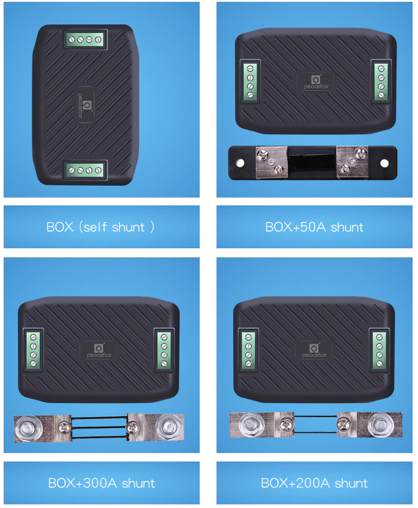
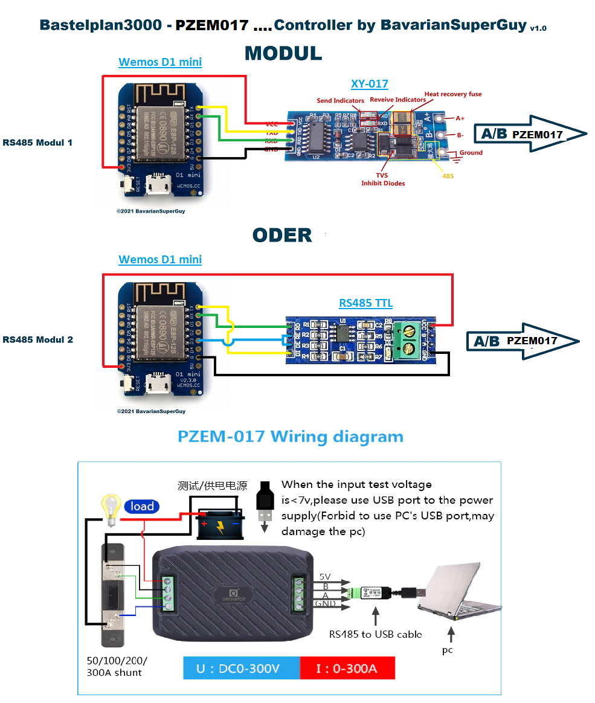

Was nett wäre, Vergesst bitte nicht meinen Kanal zu abonnieren und zu liken ;-) ... wann disliken gut wär, dann das auch :-))

https://www.youtube.com/c/BavarianSuperGuy

Ich übernehme keine Haftung für Schäden, die aufgrund der Nutzung 
der Software entstehen oder entstanden sind. 
Jeder ist für sein tun selber verantwortlich.
Mir sind keine Probleme bekannt.

GANZ UNTEN IST DAS ANSCHLUSSSCHEMA (Bastelplan3000)

3 Dinge sind wichtig für die Umsetzung dieses Projekts:
- 3,3V
- Guter Wlan Empfang(Keine Leerzeichen in der SSID vom Router)
- Readme vollstandig lesen, dann nochmal
wann readme gelesen wurde und ihr daraufhin gemerkt habt
aufgrund der Methode die beschrieben wird ,
der wlan empfang ist schlecht und lässt sich nicht ändern

... https://www.google.com/search?q=esp8266+antennenhack

ich kann keinen besseren Empfang programmiern!
und der esp kann auch nix anderes machen 
wann er ständig versucht sich  ins Wlan einzuloggen

Internet Explorer wird nicht unterstützt!(die kochen wieder eigenes Sueppchen bei Slider funktion)

# PZEM017 Controller mit Webseite
Der Esp8266 ist über ein Rs485 Modul mit dem PZEM-017 verbunden und kann diesem seine Daten entlocken.
EnergyReset Button in der ESP Web UI: Der kWh Zähler wird damit zurückgesetzt.

Die Firmware(firmware_vX.X.X.X.bin") ist im Verzeichnis espflasher.
Diese kann unkompliziert auf einen 4Mbyte Esp mit dem im Verzeichnis enhaltenen
Tool "FlashESP8266.exe" geflasht werden. 
Dieses Tool FlashESP8266.exe ist nicht von mir , aber hat schon hevorragende Dienste geleistet.

Was kann der ESP8266 PZEM017 Controller :
- Er liest die Daten über Rs485 vom PZEMModul aus : Spannung in Volt, StromLast in Ampere, Leistung in Watt, Energie in kWh
- Ausgeben tut es die Dtaen am Esp Web UI, http und mqtt interface mit Json payload
- als payload bei Mqtt für Energyreset den wert true senden

RS485 ttl Adapter (2 verschiedene getestet)
- rs485 adapter A an A von PZEM017 anschliessen und B an B

- Beim "DI DE RE RO" Rs485 Modul
werden die mittleren Rs485 Pins "DE RE" auf einen Pin gebrückt an Esp GPIO0 angeschlossen.
Dann Rs485 "DI" auf Esp TX  und Rs485 "RO" auf Esp RX 

- Beim RX TX Rs485 Modul
wird der Rs485 TX mit Esp TX verbunden und Rs485 RX mit Esp RX verbunden , also nicht kreuzen!

!Vcc ist bei beiden Modulen 3.3volt!

Keinen USB/TTL Adapter als 3,3v Poduktiv Stromquelle verwenden, für erstflashen is es OK!

ESP:

EINRICHTUNG##############################################################################################
- 0.Bei Nutzung von Mqtt: Mqtt.fx Client öffnen mit Broker verbinden und Topic : 'PZEM017/#' abonnieren
- 0.1 Es kommt nach Schritt 8. ein Info Publish vom Esp mit der IP adresse.
- 0.2 Man kann die Ip Adresse nat. auch auf dem herkömmlichen Weg herausfinden
- 1.Firmware auf den gelöschten Esp8266 flashen
- 2.Esp Neustart
- 3.Im Wlan nach PZEM017_... suchen
- 4.Wlan mit Passwort 12345678 verbinden
- 5.Es öffnet sich automatisch Browser Fenster mit 192.168.4.1
- 6.Unter Configuration
- 6.1 Wifi auswählen oder eingeben und Passwort eingeben
- 6.2 Mqtt kann derzeit nur ohne ssl und seit Version 1.0.1.1 mit  Benutzer/Passwort benutzt werden
- 7.Speichern mit dem Button ganz unten
- 8.Esp Neustart
- 9.Ipadresse in Mqtt Client oder Router ausfindig machen
EINRICHTUNG#############################################################################################

INBETRIEBNAHME##########################################################################################
- 1.Ipaddresse im browser aufrufen
INBETRIEBNAHME##########################################################################################

CONFIGPORTAL############################################################################################
Um im Nachhinein wieder ins Configportal zu kommen um die Wlan und Mqtt Daten zu ändern muss der 
- Pin RST vom ESP innerhalb 10sekunden 2X auf GND getippt werden
- Anwendungsbispiel: Taster 2mal hintereinander drücken
Daraufhin startet der ESP neu ins Configportal(EINRICHTUNG Punkt 3) , dort trägt man dann alle Daten neu ein, die fehlen
und klickt auf Save (Button ganz unten)
CONFIGPORTAL############################################################################################

Anschluss : A zu A und B zu B
getestet mit RS485 Modul1

Falls Ihr mich unterstützen wollt, Spenden sind herzlich willkommen und würde mich sehr freuen :-)
Hier bitte - https://paypal.me/armerprogrammer

